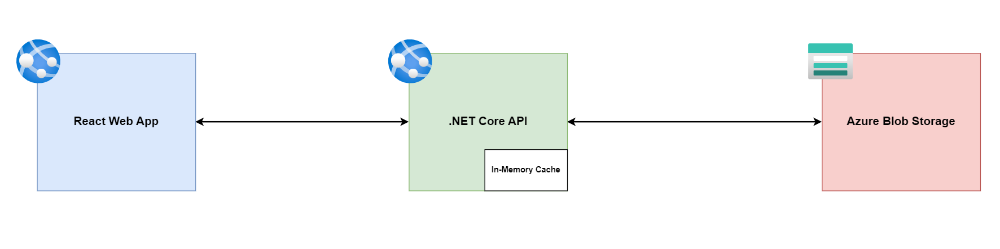

# Azure Blob Storage Demo
----
A demo project using React and Azure Blob Storage to get file data and metadata

## Architecure


## Deploying to Azure
```bash
$> az login
$> cd scripts
$> ./CreateResources.ps1
$> ./ConfigureSettings.ps1
$> ./BuildAndDeployWebApp.ps1
$> ./BuildAndDeployApi.ps1
```
## Cleanup
Run the followign command to cleanup resources
```bash
$> ./Cleanup.ps1
```